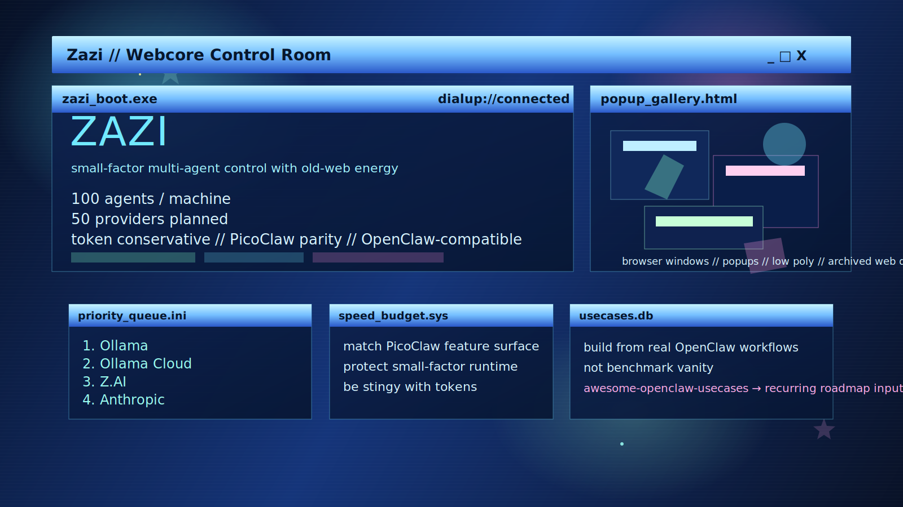
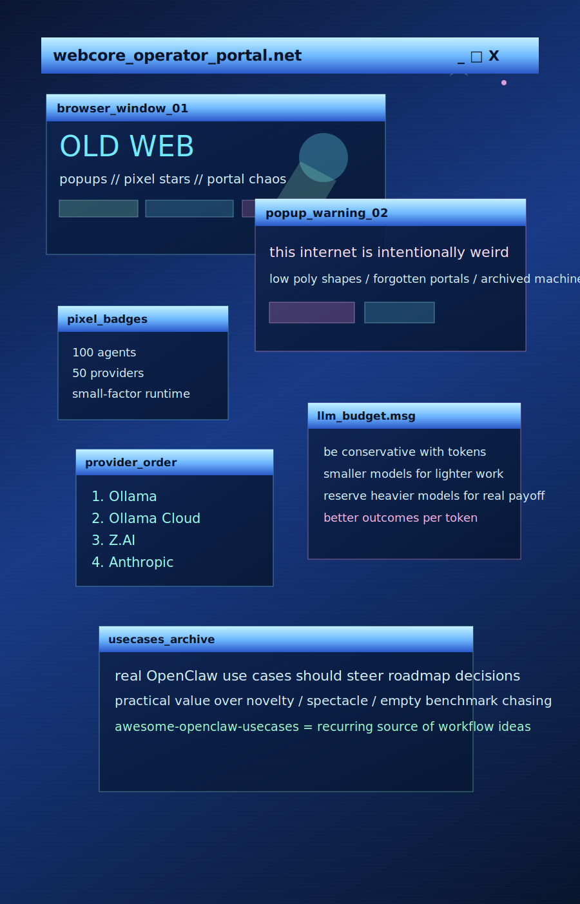

# RelayCore



RelayCore is a local-first multi-agent platform being built to beat the current open agent assistants on three fronts at once:

- more capable multi-agent orchestration on a single machine
- broader model and tool compatibility
- a cleaner, faster, smaller-feeling product surface

The project goal is not just to be feature-rich. It is to match everything PicoClaw can do in a similarly small, fast, portable package while expanding far beyond it in provider support, agent count, shared tooling, compatibility layers, and operational control.

## Product mission

RelayCore is designed as an OpenClaw and PicoClaw competitor with these non-negotiables:

1. Run up to 100 agents per machine.
2. Keep each agent isolated by default, with explicit opt-in communication rules.
3. Stay fast, lean, and conservative with resources.
4. Support many LLM backends, with Ollama, Ollama Cloud, and Z.AI prioritized first.
5. Import or adapt OpenClaw-style skills where feasible.
6. Grow into an internal skill store where people can publish, install, share, rate, and version skills.
7. Preserve a simpler operator experience than OpenClaw while retaining the polish users like in PicoClaw.

## PicoClaw parity requirements

The plan now explicitly assumes that RelayCore must eventually do everything PicoClaw does, while preserving the same spirit of small-factor performance:

- self-contained, low-overhead operation
- fast startup and low idle footprint
- multi-channel connectivity
- strong settings and model management
- clean Web UI
- portable deployment story

PicoClaw currently presents itself around very small hardware, low memory use, very fast boot, and a compact runtime footprint. RelayCore should not drift into a heavy architecture that abandons those advantages.

## Token discipline

RelayCore should be deliberately conservative with token generation and model usage. That means:

- prefer smaller models for routing, classification, filtering, and health checks
- reserve expensive models for high-value reasoning only
- support fallback chains and hard caps
- minimize prompt bloat
- make model/tool routing visible and controllable
- keep autonomous runs efficient and bounded

The right product here is not "more tokens everywhere." It is "better outcomes per token."

## Toolkit and research posture

RelayCore should learn from real OpenClaw usage, not just abstract feature lists.

- Use the `awesome-openclaw-usecases` collection as a recurring source of practical workflows and inspiration.
- Prefer features that unlock verified daily-life or operator value over novelty.
- Treat community skills, plugins, and shared automation as useful but potentially unsafe by default.

## What exists right now

- dependency-light Node codebase
- SQLite-backed local agent registry
- browser control UI served directly by the API
- agent creation and agent-to-agent link rules
- seeded machine topology
- provider catalog with 50 target backends
- first provider roadmap with ordered implementation priorities
- tests covering agent capacity, self-link rejection, and provider catalog coverage

## Current provider priority

These providers come first before the rest of the 50-provider matrix:

1. Ollama
2. Ollama Cloud
3. Z.AI
4. Anthropic
5. OpenAI

After those five, the remaining catalog can be implemented in waves.

## Current architecture snapshot

- `apps/api`: local control API, agent registry, provider metadata endpoints
- `apps/web`: control UI and themed operator surface
- `packages/shared`: shared validation, provider catalog, and contract helpers
- `docs/architecture.md`: architecture direction
- `docs/provider-plan.md`: provider rollout and coding plan

## Quick start

```bash
npm run dev
```

The API and UI are served from `http://localhost:4000`.

## Current API endpoints

- `GET /health`
- `GET /api/topology`
- `GET /api/agents`
- `POST /api/agents`
- `POST /api/links`
- `GET /api/providers`

## Roadmap themes

1. Provider abstraction and live adapters
2. Multi-agent orchestration and permissions
3. Internal skill store foundations
4. OpenClaw skill compatibility
5. Run history, observability, and safety controls
6. Tight footprint and speed work so the system stays PicoClaw-competitive in feel

## Design direction

The current UI direction uses a cleaner control-plane presentation layer:

- serious operator-first hierarchy instead of decorative nostalgia
- strong runtime metrics and deployment actions in the first viewport
- restrained industrial styling with clear state surfaces and fewer gimmicks
- product language centered on routing, policy, provider coverage, and capacity

The visual system should feel compact, confident, and deployment-ready while still retaining enough atmosphere to feel like a modern agent operations product.

## Visual direction


